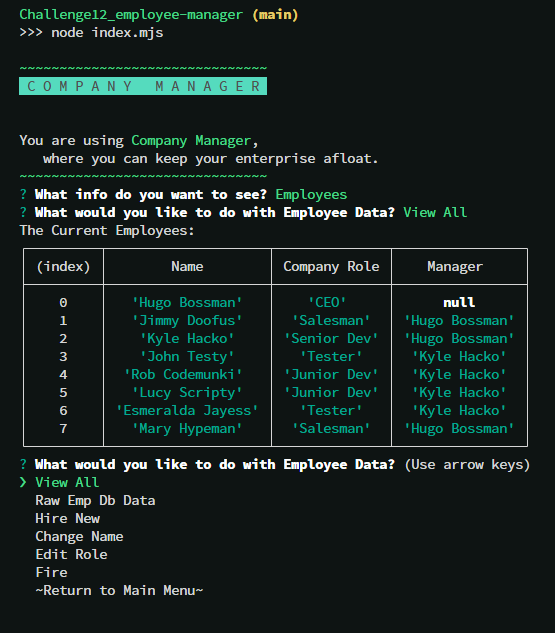

# 👨‍💼 Company Manager 💼
  
  

## TABLE OF CONTENTS:

* [Description](#description)

* [Installation guide](#installation) 

* [Usage Info](#usage) 

* [Contribution Guidelines](#contribution) 

* [Testing Instructions](#testing) 

* [Questions](#questions)

* [Credits](#credit)

* [License](#license)

## DESCRIPTION:

This is the ReadMe for Matthew Lawhorn's project titled: Company Manager

This is Challenge 12 for the Fall 2022 UT Coding Bootcamp. This app is a command line program allowing a businesses' management to access HR data and alter it. 

## INSTALLATION:

Install Node.js globally, cd to the file location of app, and run the app in Node

## USAGE:

Follow the prompts given.

## CONTRIBUTION:

Sorry, this project is privately maintained.

## TESTING:

Thank you, but no testing is needed at this time.

## QUESTIONS:

If you have any questions,

you can find my GitHub here: https://github.com/Lawhornmatt

or email me here: fake@notreal.com

## CREDIT:

This project was made in 2022 by Matthew Lawhorn

This is a solo-project.

## LICENSE:

This program is copyrighted under the MIT open source license.

Copyright 2022 Matthew Lawhorn

    Permission is hereby granted, free of charge, to any person obtaining a copy of this software and associated documentation files (the "Software"), to deal in the Software without restriction, including without limitation the rights to use, copy, modify, merge, publish, distribute, sublicense, and/or sell copies of the Software, and to permit persons to whom the Software is furnished to do so, subject to the following conditions:
    
    The above copyright notice and this permission notice shall be included in all copies or substantial portions of the Software.
    
    THE SOFTWARE IS PROVIDED "AS IS", WITHOUT WARRANTY OF ANY KIND, EXPRESS OR IMPLIED, INCLUDING BUT NOT LIMITED TO THE WARRANTIES OF MERCHANTABILITY, FITNESS FOR A PARTICULAR PURPOSE AND NONINFRINGEMENT. IN NO EVENT SHALL THE AUTHORS OR COPYRIGHT HOLDERS BE LIABLE FOR ANY CLAIM, DAMAGES OR OTHER LIABILITY, WHETHER IN AN ACTION OF CONTRACT, TORT OR OTHERWISE, ARISING FROM, OUT OF OR IN CONNECTION WITH THE SOFTWARE OR THE USE OR OTHER DEALINGS IN THE SOFTWARE.

[Further license information can be found here.](https://opensource.org/licenses/MIT)

